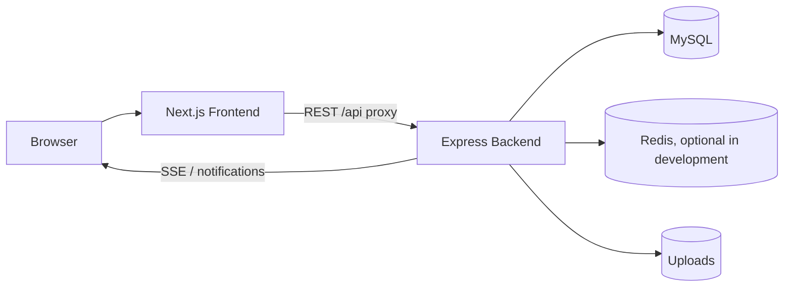

# SIPENA

SIPENA adalah aplikasi web untuk pengelolaan inventaris sarana rumah sakit, mulai dari pendataan aset, peminjaman, pengembalian, penggunaan, pemeliharaan, sampai pelaporan dan arsip aktivitas. Repository ini memakai monorepo dengan frontend Next.js, backend Express, dan artefak database SQL yang dipisahkan agar pengembangan dan deployment lebih terarah.

Codebase ini juga memuat dokumentasi API, skema database, workflow migrasi, Selenium e2e test, dan konfigurasi deployment. Semua dokumentasi di bawah ini ditulis berdasarkan struktur repository yang ada saat ini.

## Overview

Tujuan utama SIPENA adalah membantu pengelolaan sarana rumah sakit secara terpusat, auditable, dan mudah ditelusuri. Sistem ini mengurangi proses manual yang tersebar, menjaga konsistensi status aset, dan memudahkan petugas dalam memantau siklus hidup inventaris.

Pengguna utama yang terlihat dari codebase adalah:

- `admin`
- `leader`
- `staff`
- `staff_pj`
- `teknisi`
- `user`

## Features

| Module | Scope |
| --- | --- |
| Authentication | Login, register, logout, profile, change password, reset password, dan upload foto profil. |
| User Management | CRUD user, bulk delete, reset password per user, status akun, dan pengaturan akses UML. |
| Role-Based Access Control | Pemetaan role ke menu, matrix role-menu, dan default permission seed. |
| Asset Management | Inventaris aset medis dan non-medis, detail aset, import dari Excel, pencarian, filter, dan reset inventory. |
| Borrowing | Pengajuan peminjaman, approval/rejection, return validation, extension, blocking check, dan owner lookup berdasarkan akun aktif. |
| Return | Pencatatan pengembalian dan validasi pengembalian. |
| Asset Usage | Pencatatan penggunaan aset, riwayat penggunaan, soft delete/archiving, dan overview ambang penggunaan. |
| Maintenance | Request, scheduling, update, completion, attachment upload, reminder dispatch, technician lookup, dan maintenance history. |
| Sanctions | Daftar sanksi keterlambatan, statistik, resolve, dan waive. |
| Asset Disposal | Pengajuan disposal, approval, rejection, dan penghapusan request oleh admin. |
| Deletion Requests | Permintaan penghapusan data untuk user, borrowing, return, dan maintenance dengan alur review admin. |
| DSS Priority | Ranking prioritas aset dengan bobot manual atau AHP, TOPSIS, sensitivity analysis, method comparison, scenario comparison, dan history. |
| Reports | Dashboard laporan, laporan aset/peminjaman/pemeliharaan/penggunaan, export PDF/Excel/CSV, dan report uploads. |
| Notifications | Inbox notifikasi, unread count, mark as read, broadcast admin, delivery status, dan SSE stream. |
| Activity Archive | Riwayat aktivitas pengguna dan arsip penggunaan/peminjaman. |
| App Settings | Pengaturan global dan pengumuman topbar. |
| System Documentation | Endpoint OpenAPI/Swagger dan halaman UML. |
| QR/Barcode Scan | Scan dari kamera atau image upload untuk pencarian aset. |

## Tech Stack

| Layer | Technology |
| --- | --- |
| Frontend | Next.js 16, React 19, TypeScript, Tailwind CSS, Radix UI, shadcn/ui |
| Backend | Express 4, TypeScript, Sequelize TypeScript, mysql2, Joi, express-validator |
| Database | MySQL-compatible SQL schema and migrations |
| Authentication | JWT, session versioning, password reset via Twilio Verify or webhook fallback |
| API | REST JSON, OpenAPI 3.1, Swagger UI |
| Testing | Vitest, Supertest, Selenium WebDriver, Node test runner |
| Deployment | Docker, Docker Compose, Railway config, GitHub Actions |

## Architecture



## Repository Structure

```text
.
├── apps/
│   ├── backend/
│   └── frontend/
├── database/
├── docker/
├── docs/
├── scripts/
├── selenium/
├── railway.json
├── package.json
└── README.md
```

## Documentation

- [`apps/backend/README.md`](apps/backend/README.md) - backend API, env, endpoint, dan runtime.
- [`apps/frontend/README.md`](apps/frontend/README.md) - frontend, proxy API, dan command UI.
- [`database/README.md`](database/README.md) - seed, migrasi, dan inisialisasi database.
- [`selenium/README.md`](selenium/README.md) - setup dan cakupan e2e test.
- [`docs/PRD.md`](docs/PRD.md) - baseline kebutuhan produk.

## Requirements

- Node.js `>=20.19.0`
- npm `>=11.7.0`
- MySQL-compatible database
- Redis untuk fitur yang bergantung pada cache, ticket SSE, dan OTP flow
- Chrome jika ingin menjalankan Selenium e2e

## Environment

File env yang tersedia:

- `./.env.example`
- `apps/backend/.env.example`
- `apps/frontend/.env.example`

Variabel penting yang dipakai codebase:

| Area | Variables |
| --- | --- |
| Runtime | `NODE_ENV`, `PORT`, `FRONTEND_URL`, `TRUST_PROXY_HOPS` |
| Database | `DB_HOST`, `DB_PORT`, `DB_NAME`, `DB_USER`, `DB_PASSWORD`, `DB_CONNECTION_LIMIT`, `DB_QUEUE_LIMIT`, `DB_CONNECT_TIMEOUT_MS`, `DB_IDLE_TIMEOUT_MS`, `DB_KEEP_ALIVE_INITIAL_DELAY_MS` |
| Auth | `JWT_SECRET`, `INITIAL_ADMIN_*`, `ALLOW_IN_MEMORY_PASSWORD_RESET_STORE` |
| Frontend proxy | `NEXT_PUBLIC_API_URL`, `API_PROXY_TARGET`, `NEXT_PUBLIC_LOGIN_REQUEST_TIMEOUT_MS`, `API_PROXY_TIMEOUT_MS` |
| Redis / SSE | `REDIS_HOST`, `REDIS_PORT`, `REDIS_PASSWORD`, `SSE_TICKET_TTL_SECONDS` |
| OTP / notification | `TWILIO_*`, `WHATSAPP_*`, `SMS_*`, `SMTP_*`, `EMAIL_*`, `OTP_BRAND_NAME`, `NOTIFICATION_BRAND_NAME` |
| Uploads / bootstrap | `UPLOADS_ROOT`, `DB_AUTO_INIT_FROM_SCHEMA` |
| Rate limit | `GENERAL_RATE_LIMIT_MAX`, `LOGIN_RATE_LIMIT_MAX`, `REGISTER_RATE_LIMIT_MAX`, `PASSWORD_RESET_RATE_LIMIT_MAX` |

Frontend dapat memakai same-origin proxy jika `NEXT_PUBLIC_API_URL` dikosongkan. Pada mode itu browser memanggil `/api`, lalu route handler Next.js meneruskan request ke backend via `API_PROXY_TARGET`.

## Local Setup

### 1. Install dependencies

```bash
npm ci
```

### 2. Prepare env files

Salin file contoh yang sesuai ke file lokal masing-masing workspace.

```bash
cp .env.example .env
cp apps/backend/.env.example apps/backend/.env
cp apps/frontend/.env.example apps/frontend/.env.local
```

### 3. Start database

Codebase ini memakai MySQL-compatible database. Redis bersifat optional di development, tetapi beberapa fitur backend akan lebih lengkap jika Redis tersedia.

### 4. Run the app

Untuk development, jalankan backend dan frontend di terminal terpisah:

```bash
npm run dev:backend
npm run dev --workspace=inventory-frontend
```

Jika ingin stack containerized, gunakan Docker Compose:

```bash
docker compose -f docker/compose.yml up --build
```

## Scripts

### Root

| Command | Purpose |
| --- | --- |
| `npm run dev` | Menjalankan frontend workspace `inventory-frontend`. |
| `npm run dev:backend` | Menjalankan backend workspace `inventory-backend`. |
| `npm run build` | Build backend lalu frontend. |
| `npm run lint` | Lint backend dan frontend. |
| `npm run type-check` | Type-check frontend. |
| `npm run test:backend` | Menjalankan unit test backend. |
| `npm run test:selenium` | Menjalankan Selenium e2e suite. |
| `npm run test:selenium:smoke` | Smoke test Selenium. |
| `npm run test:selenium:core` | Core regression Selenium. |
| `npm run test:selenium:matrix` | Matrix status aset Selenium. |
| `npm run verify` | Lint, build, type-check, dan test backend. |
| `npm run start` | Production start via `scripts/start-production.sh`. |
| `npm run configure:notifications` | Mengatur kanal notifikasi runtime. |
| `npm run bootstrap:test-admin` | Menyiapkan admin test untuk Selenium. |
| `npm run migrate:user-security-columns` | Menjalankan migrasi keamanan user. |
| `npm run migrate:prod` | Menjalankan migrasi production dari hasil build. |

### Backend workspace

| Command | Purpose |
| --- | --- |
| `npm run dev --workspace=inventory-backend` | Backend development server. |
| `npm run build --workspace=inventory-backend` | Compile TypeScript backend. |
| `npm run start --workspace=inventory-backend` | Menjalankan backend dari `dist/`. |
| `npm run lint --workspace=inventory-backend` | ESLint backend. |
| `npm run test --workspace=inventory-backend` | Vitest backend. |
| `npm run migrate --workspace=inventory-backend` | Migration runner. |

### Frontend workspace

| Command | Purpose |
| --- | --- |
| `npm run dev --workspace=inventory-frontend` | Next.js development server. |
| `npm run build --workspace=inventory-frontend` | Production build frontend. |
| `npm run start --workspace=inventory-frontend` | Menjalankan hasil build frontend. |
| `npm run lint --workspace=inventory-frontend` | ESLint frontend. |
| `npm run type-check --workspace=inventory-frontend` | TypeScript check frontend. |
| `npm run test --workspace=inventory-frontend` | Vitest frontend. |

## Database

- Skema utama ada di `database/seeds/schema.sql`.
- Migrasi aktif ada di `database/migrations/`.
- Seed dan workflow impor lokal didokumentasikan di [`database/README.md`](database/README.md).
- Backend membaca migrasi dari folder root `database/migrations` dan menyimpan status migrasi yang sudah dijalankan.

Untuk database baru, backend mendukung bootstrap admin awal lewat variabel `INITIAL_ADMIN_*` dan opsi `DB_AUTO_INIT_FROM_SCHEMA` untuk inisialisasi dari schema SQL pada database kosong.

## Deployment

- `railway.json` memakai `docker/Dockerfile` sebagai build source dan `scripts/start-production.sh` sebagai production start command.
- Docker Compose didefinisikan di `docker/compose.yml`, dengan override lokal di `docker/compose.override.yml`.
- GitHub Actions tersedia di `.github/workflows/ci.yml` dan `.github/workflows/deploy.yml`.
- Workflow CI menjalankan install, environment hygiene, audit, lint, build, dan backend test.
- Workflow deploy menjalankan validasi yang sama lalu deploy ke VPS via Docker Compose.

## Notes

- Endpoint dokumentasi API tersedia di `/api/docs` dan `/api/docs/openapi.json`.
- `GET /health` dan `GET /api/health` digunakan untuk health check.
- File upload dipisahkan per domain, terutama untuk foto profil, laporan, maintenance, dan pengumuman.
- Detail implementasi per workspace tetap terdokumentasi di README masing-masing folder agar root README tetap ringkas.
